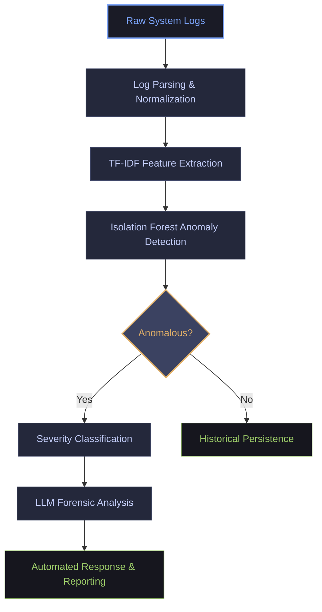

<p align="center">
  
</p>

<h1 align="center">AI Log Guard</h1>

<p align="center">
  <strong>Intelligent Anomaly Detection & Automated Threat Response System</strong>
</p>

<p align="center">
  
  
  
  
</p>

---

## 📖 Project Abstract

**AI Log Guard** is an advanced cybersecurity platform that transforms raw system logs into **actionable security intelligence**.  
Unlike traditional rule-based monitoring tools, it uses a **hybrid AI approach** capable of detecting **zero-day exploits, insider threats, and evolving attack patterns** in real time.

Developed as a **Final Year Project (FYP)** at **COMSATS University Islamabad**, this project combines **machine learning, large language models (LLMs), and automated incident response** into a unified security solution.

---

## 🎬 Demo

<p align="center">
  
</p>

<p align="center">
  <em>Real-time log monitoring, anomaly detection, and automated response in action</em>
</p>

---

## 📸 Screenshots

| Login Page | Dashboard | Anomaly Report |
|------------|-----------|----------------|
|  |  |  |


---

## ✨ Key Innovations

### 🧠 Hybrid Detection Engine
- Combines **Isolation Forest (unsupervised anomaly detection)** with **TF-IDF vectorization**.
- Detects statistical deviations **without labeled datasets**.
- Highly effective against unknown and evolving threats.

### 🕵️ LLM-Driven Forensic Intelligence
- Integrates **Gemini 2.0 Flash** via **OpenRouter API**.
- Converts anomaly scores into:
  - Human-readable explanations
  - Attack summaries
  - Step-by-step remediation guidance
- Solves the *“black-box AI”* problem for security analysts.

### ⚡ Real-Time Automated Response
- Multi-threaded Python architecture with **sub-second latency**.
- Supports automated mitigation actions, including:
  - IP blocking
  - Alert generation
  - Incident logging

---

## 🛠️ Technical Architecture

| Layer | Technology |
|-------|-----------|
| **Frontend** | CustomTkinter (Modern, Dark-Mode UI) |
| **Analysis Engine** | Scikit-learn, Pandas, NumPy |
| **ML Algorithms** | Isolation Forest, TF-IDF |
| **LLM Intelligence** | Gemini 2.0 Flash (OpenRouter API) |
| **Threat Intelligence** | IP-API.com |
| **Persistence** | SQLite (Thread-Safe Singleton Pattern) |
| **Concurrency** | Python Multithreading |

---

## 🏗️ System Workflow




---

## 📁 Project Structure
```text
FYP PROJECT
├── 🎨 assets/             # Branding, high-DPI UI icons, and demo media
├── 💾 backups/            # Local data recovery and log archives
├── ⚡ cache/              # Temporary buffers and IP reputation cache
├── ⚙️ config/             # Environment variables and API configurations
├── 📊 data/               # Input log datasets (Simulated & Real-world)
├── 📜 reports/            # Generated security audits (PDF & CSV)
│
├── 🧠 src/
│   ├── 🛠️ backend/
│   │   ├── core_logic.py   # The "Brain": Anomaly detection & rule execution
│   │   ├── database_mgr.py # Singleton SQLite transaction manager
│   │   └── llm_service.py  # Gemini 2.0 forensic analysis engine
│   │
│   ├── 🎮 controller/
│   │   └── main.py         # Application controller & page navigation
│   │
│   ├── 🖥️ ui/
│   │   ├── components/     # Custom modern themed widgets
│   │   └── pages/          # Dashboard, Live Monitor, and Forensic views
│   │
│   └── 🔧 utils/           # Helper functions for regex and normalization
│
├── 🌍 config.py           # Global system constants
├── 🛡️ AiLogGuard.py       # Main Application Entry Point
└── 📄 README.md           # Documentation & Project Sentinel
```


---

## 🚀 Getting Started

### Prerequisites
- Python **3.8+** (Tested on **3.13.7**)
- OpenRouter API Key (for LLM forensic analysis)

### Installation
```bash
# Clone the repository
git clone [https://github.com/MohsinHaiderSultan/AI-Log-Guard.git](https://github.com/MohsinHaiderSultan/AI-Log-Guard.git)

# Navigate to project
cd "FYP Project"

# Install requirements
pip install -r requirements.txt

# Run the system
python AiLogGuard.py
```
---

## 🧪 Machine Learning Methodology

**Feature Engineering**
- TF-IDF vectorization of log messages
- Temporal and statistical features

**Detection Strategy**
- Unsupervised anomaly detection (Isolation Forest)
- Adaptive thresholding

**Output**
- Normal vs Anomalous classification
- Severity scoring
- Natural-language forensic explanation

---

## 🔮 Future Enhancements

- Deep learning–based detection models (LSTM, Autoencoders)
- Real-time log streaming (Kafka / Syslog)
- Web-based Security Operations Center (SOC) dashboard
- SIEM platform integration
- Alerting via Email, Slack, and SMS
- Cloud-scale log ingestion and analysis

---

## 👨‍💻 Author

## 👨‍💻 Author

<table align="center">
  <tr>
    <td align="center">
      <a href="https://github.com/MohsinHaiderSultan">
        
        <br />
        <sub><b>Mohsin Haider Sultan</b></sub>
      </a>
      <br /><br />
      <a href="https://www.linkedin.com/in/mohsin-haider-sultan">
        
      </a>
      <a href="https://github.com/MohsinHaiderSultan">
        
      </a>
      <a href="mailto:mohsinhaidersultan@gmail.com">
        
      </a>
    </td>
  </tr>
</table>


<p align="center"> Developed at <b>COMSATS University Islamabad</b> <br /> &copy; 2026 Mohsin Haider Sultan & Team. All Rights Reserved. </p>

